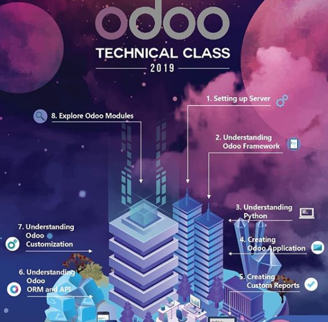
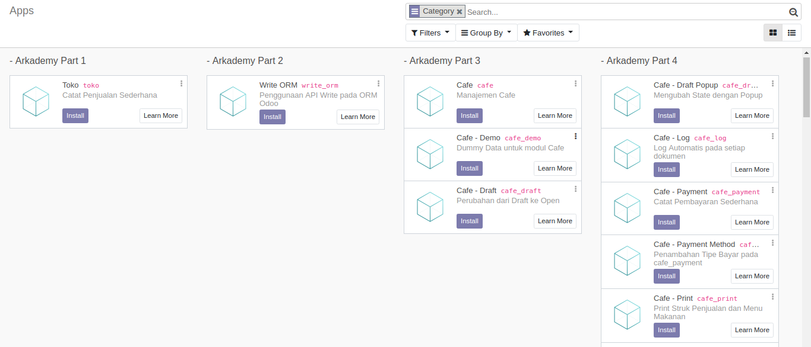

# [Arkademy Training Material](https://www.arkana.co.id/)
Arkana is helping developers to learn Odoo by Arkademy Training

* **Prioritized:** Arkademy has clear definition of learning steps that easy to adopt by senior, junior even non-developer. We make it painless to create business application within Odoo framework. Step-by-step learning from designing simple form to handling complex business process with intuitive examples.
* **Full-Packaged:** Through its great concept of exemplification, trainee will get *insha Allah* massive experience of building simple model, simple function and even complex model-relationships. Odoo has vast tweaks and unique build-in functionalities. This material training covers more than basic needs of future Odoo developers.
* **Learn Report, Learn Pivot:** Odoo has capabilities to help business owners analyze their company activities. In this material, we also help developers to build PDF Reporting and Pivot Analysis

[Learn how to enroll the training](https://www.instagram.com/arkanadigital/).

## Syllabus

## Syntax Learning

To prevent unproductive training session, [Arkana](https://www.instagram.com/arkanadigital/) compiled most-used syntax in building Odoo modules. With our experienced, we underlined most-frequent syntax used in this training and set it up as *Auto-Completion*. Arkademy enthusiastically encourages trainee to use VS Code and its extension, [Arkademy - Odoo Technical Training](https://marketplace.visualstudio.com/items?itemName=arkademy.arkademy-training)

* **Auto Completion:** Odoo syntax sometimes is felt atypical to some developers. This extension prevents mistyped syntax with 1600 lines of snippets both in **python** and **xml**.
* **Keyboard Shortcuts:** This extension also alters and adds additional shortcut that frequently used in our Odoo-related work.

## Step-by-Step Learning

This material comprises of 18 beautifully-crafted modules. Generally, this material is divided into three business app: **Toko**, **Cafe** and **Sale Promotion**. Also, as additional material, we provide **Write - ORM** module to help trainee learns built-in object-relational mapping systematically and comprehensively.

### License

Arkademy Training Material is [LGPLv3 licensed](./LICENSE).

#### Distribution and Sharing Policy

Material holder may distribute, copy and share this material content by using flash-disk, Google Drive or typical file-sharing site to their colleague **internally**. Material may be redistributed with its attribution to Arkademy and cannot be *renamed* or *rebranded*.

Material holder **cannot** redistribute this material content **publicly** to communities or even world-wide, in public file-sharing site, like Github, Mediafire or another typical file-hosting site.
